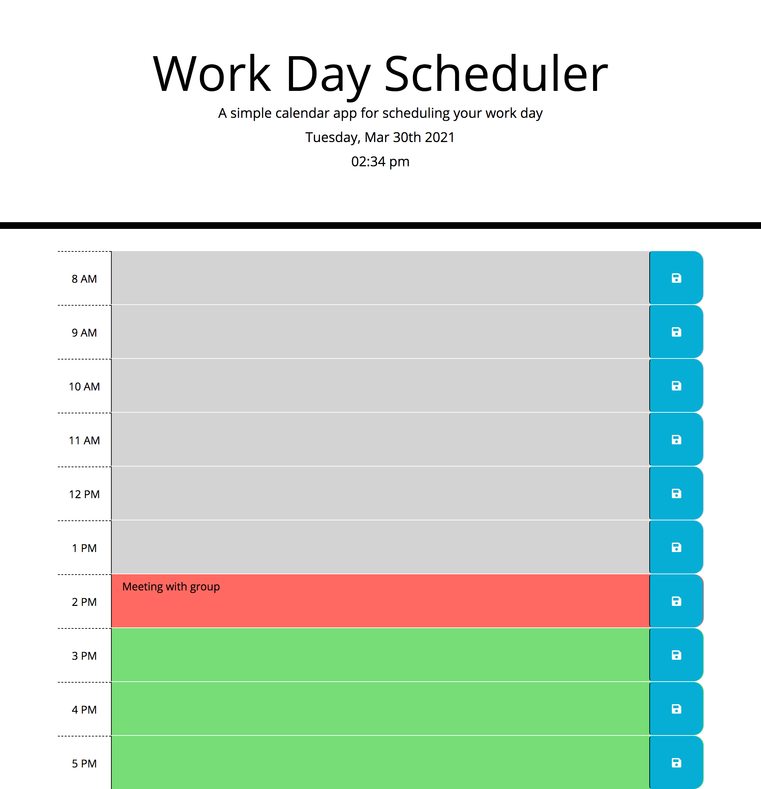

# Work Day Scheduler

This program uses Javascript CSS HTML and API's to make a dynamic work day scheduler.

The user is provided with the current date and time when they visit the website. 
Time blocks are color coded depending on past, present, and future.
User will have the option to save an event for desired time block.

The project has been has been published to GitHub pages listed below. 

Link to application https://landonwilson1.github.io/work-day-scheduler/

